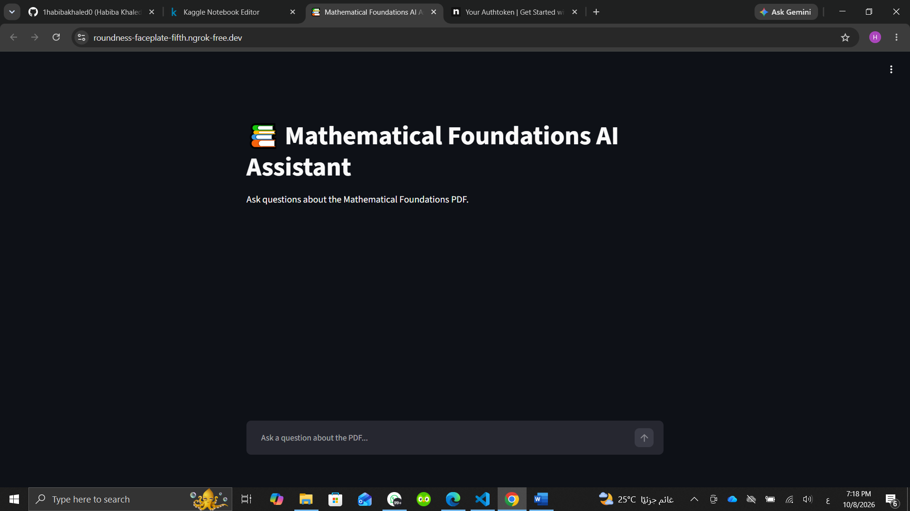
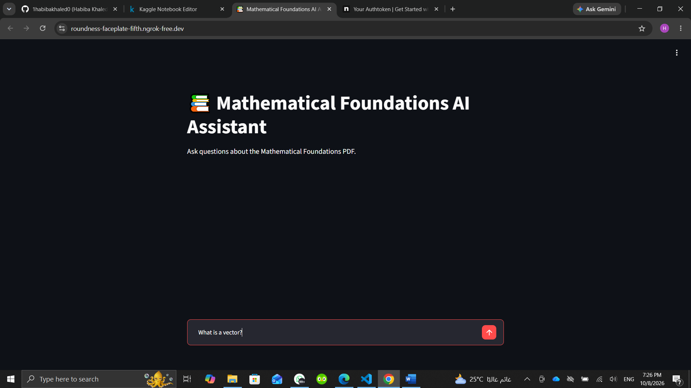
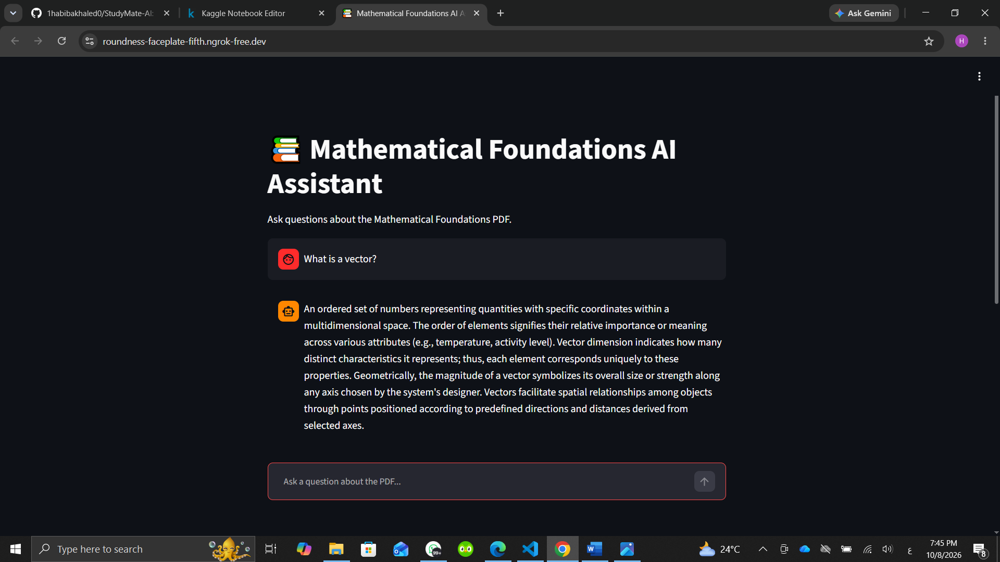

# 📚 Mathematical Foundations AI Study Assistant

An AI-powered educational assistant designed to answer questions from the **Mathematical Foundations lecture PDF**.

The system combines **Retrieval-Augmented Generation (RAG)**, semantic search, a Large Language Model, and an interactive Streamlit interface to provide answers grounded in the lecture material.

---

## 👤 Participant

| Field                | Value                                       |
| -------------------- | ------------------------------------------- |
| **Full Name**        | Habiba Khalid Shaban Mohamed Maray          |
| **Project Name**     | Mathematical Foundations AI Study Assistant |
| **GitHub Username**  | 1habibakhaled0                              |
| **Internship Batch** | August–October 2026                         |
| **Training Program** | Large Language Models (LLMs) Program        |
| **Organization**     | Edrak for AI                                |

---

## 📖 Project Overview

The **Mathematical Foundations AI Study Assistant** is an AI-based educational assistant designed to help students study and understand mathematical foundations lecture materials.

The project uses a **Retrieval-Augmented Generation (RAG)** pipeline. The lecture PDF is processed, divided into smaller chunks, converted into vector embeddings, and stored in a **FAISS vector database**.

When a student asks a question, the system retrieves the most relevant sections from the lecture and provides them as context to a Large Language Model. The LLM then generates an answer based on the retrieved information.

The goal is to provide a simple and interactive way for students to ask questions about their study material instead of manually searching through the entire PDF.

---

## 🔄 Project Pipeline

```text
PDF
↓
Text Chunking
↓
Embeddings
↓
FAISS Vector Database
↓
Retriever
↓
RAG
↓
Qwen2.5-1.5B-Instruct
↓
Output Parser
↓
Streamlit GUI
↓
Ngrok
```

---

## 🤖 Models

### LLM

**Qwen/Qwen2.5-1.5B-Instruct**

Used to generate answers based on the context retrieved from the lecture material.

### Embedding Model

**sentence-transformers/all-MiniLM-L6-v2**

Used to convert document chunks and queries into numerical vector representations.

### Vector Database

**FAISS**

Used to store embeddings and perform efficient similarity-based retrieval.

---

## ✨ Main Features

* 📄 **PDF Question Answering**
* 🔎 **Semantic Retrieval**
* 🧠 **Retrieval-Augmented Generation (RAG)**
* 🤖 **LLM Integration**
* 📝 **Output Parsing**
* 💬 **Conversation Memory**
* 🌐 **Streamlit GUI**
* 🔗 **Public Access Using Ngrok**
* 🧪 **Out-of-Domain Evaluation**
* 📊 **Evaluation Visualizations**

---

## 🛠️ Technologies Used

### Programming Language

* Python

### AI & LLM

* Hugging Face Transformers
* Qwen/Qwen2.5-1.5B-Instruct
* Large Language Models

### RAG

* LangChain
* Retrieval-Augmented Generation
* Retriever
* Output Parser

### Embeddings & Vector Search

* Sentence Transformers
* FAISS

### Document Processing

* PyPDFLoader
* PDF Text Extraction
* Text Chunking

### Interface & Access

* Streamlit
* Ngrok

### Development Environment

* Kaggle Notebooks

---

## 🧪 Evaluation Dataset

**SQuAD 2.0** was used as an **out-of-domain evaluation dataset**.

The dataset is **not used as the knowledge source** of the assistant.

Instead, it is used to test whether the system correctly refuses questions whose answers are not contained in the **Mathematical Foundations PDF**.

The expected fallback response is:

```text
The PDF does not specify this information.
```

This evaluation helps measure the system's ability to avoid generating unsupported answers when the required information is outside the knowledge contained in the lecture material.

---

## 🚀 Usage

The system follows a complete RAG workflow.

### Step 1 — Load the PDF

The Mathematical Foundations lecture PDF is loaded and processed using a PDF loader.

### Step 2 — Text Chunking

The extracted document text is divided into smaller chunks to make semantic retrieval more efficient.

### Step 3 — Create Embeddings

Each text chunk is converted into a vector representation using the Sentence Transformers embedding model.

### Step 4 — Build the FAISS Vector Database

The generated embeddings are stored in FAISS to enable similarity-based retrieval.

### Step 5 — Retrieve Relevant Information

When a user asks a question, the retriever searches the vector database and returns the most relevant lecture content.

### Step 6 — Generate the Answer

The retrieved context is passed to **Qwen/Qwen2.5-1.5B-Instruct**, which generates an answer based on the available context.

### Step 7 — Output Parsing

The generated response is processed using an output parser to produce the final answer shown to the user.

### Step 8 — Conversation Memory

Conversation memory allows the assistant to maintain context during an interactive study session.

### Step 9 — Streamlit Interface

A Streamlit graphical interface allows students to interact with the study assistant.

The Streamlit application was tested using **Ngrok on Kaggle Notebooks** to provide temporary public access during the demonstration.

---

## 📸 Demo

The project was tested through an interactive **Streamlit interface**.

The demo shows how a student can enter a question and receive an answer generated from relevant content retrieved from the Mathematical Foundations lecture PDF.

### 🖥️ Streamlit Interface



### 💬 Asking a Question



### 🤖 Generated Answer



### Demo Workflow

```text
User Question
↓
Semantic Retrieval
↓
Relevant Lecture Context
↓
Qwen2.5-1.5B-Instruct
↓
Generated Answer
```

---

## 📈 Results

The project successfully demonstrates a complete **Retrieval-Augmented Generation pipeline** for educational question answering.

The system can:

* Process the Mathematical Foundations lecture PDF.
* Divide lecture content into smaller searchable chunks.
* Generate embeddings for the document.
* Store embeddings in a FAISS vector database.
* Retrieve relevant information using semantic similarity.
* Generate context-aware answers using Qwen2.5-1.5B-Instruct.
* Maintain conversation context using memory.
* Provide an interactive Streamlit interface.
* Evaluate the system using out-of-domain questions.
* Visualize evaluation results.

The out-of-domain evaluation also tests whether the assistant correctly refuses questions when the required information is not available in the lecture PDF.

---

## 🔮 Future Improvements

Possible improvements for the project include:

* 📚 Support multiple lecture PDFs and different courses.
* 🎯 Improve retrieval accuracy using reranking techniques.
* 💬 Add more advanced conversation memory.
* 📝 Add automatic quiz and MCQ generation.
* 📊 Add student progress and study tracking.
* 🌐 Deploy the application as a permanent web application.
* 🔊 Add optional voice-based interaction.
* 📈 Improve evaluation using larger and more diverse datasets.

---

## 📚 About the Internship

This project was developed as part of the **Tips Hindawi Internship (August–October 2026)** in the **Large Language Models (LLMs) Program**.

The internship focuses on practical training in **Large Language Models** and encourages participants to apply their knowledge by developing real-world AI applications.

Through this project, I gained practical experience with:

* Large Language Models
* Retrieval-Augmented Generation
* Semantic Search
* Embeddings
* FAISS Vector Databases
* Prompt Engineering
* Conversation Memory
* Model Evaluation
* Streamlit
* AI Application Development

The internship is organized by **Tips Hindawi**, the internships department of **Edrak for AI**.

---

## 📄 License

This project is shared for **educational and portfolio purposes**.

© 2026 Habiba Khalid Shaban Mohamed Maray
